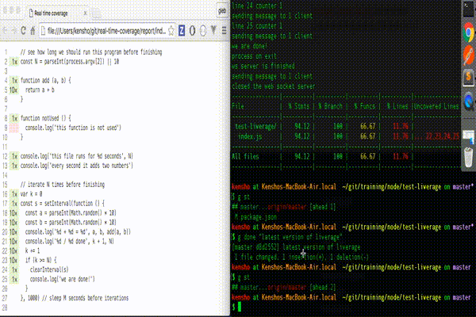

# liverage

> Makes your code coverage a real time live source

[![NPM][npm-icon] ][npm-url]

[![Build status][ci-image] ][ci-url]
[![semantic-release][semantic-image] ][semantic-url]
[![js-standard-style][standard-image]][standard-url]



## Install and use

Assuming that you use a Node code coverage tool like [nyc](https://www.npmjs.com/package/nyc)
to instrument your code

```sh
npm install --save-dev liverage nyc
```

Then load `liverage` when running `nyc` using script command in `package.json`

```json
{
    "scripts": {
        "test": "nyc --require liverage node index.js"
    }
}
```

Run `npm test` and the process becomes a WebSocket server 
(via [ws](https://www.npmjs.com/package/ws)) on default port 3032. 

There is a simple example included with this repository you can observe if you clone it

```sh
git clone git@github.com:bahmutov/liverage.git
cd liverage
npm run example-live
# starts a server, need a WebSocket client to observe
```

## Client

You can observe the live code coverage using any WebSocket client, for example a CycleJs one from
[real-time-coverage](https://github.com/bahmutov/real-time-coverage) repo. Details are coming.

## Roadmap

Currently `liverage` collects and sends the messages for the last covered file, thus if the server
program is composed of multiple source files, the client will not be able to see them.

### Small print

Author: Gleb Bahmutov &lt;gleb.bahmutov@gmail.com&gt; &copy; 2016

* [@bahmutov](https://twitter.com/bahmutov)
* [glebbahmutov.com](http://glebbahmutov.com)
* [blog](http://glebbahmutov.com/blog)

License: MIT - do anything with the code, but don't blame me if it does not work.

Support: if you find any problems with this module, email / tweet /
[open issue](https://github.com/bahmutov/liverage/issues) on Github

## MIT License

Copyright (c) 2016 Gleb Bahmutov &lt;gleb.bahmutov@gmail.com&gt;

Permission is hereby granted, free of charge, to any person
obtaining a copy of this software and associated documentation
files (the "Software"), to deal in the Software without
restriction, including without limitation the rights to use,
copy, modify, merge, publish, distribute, sublicense, and/or sell
copies of the Software, and to permit persons to whom the
Software is furnished to do so, subject to the following
conditions:

The above copyright notice and this permission notice shall be
included in all copies or substantial portions of the Software.

THE SOFTWARE IS PROVIDED "AS IS", WITHOUT WARRANTY OF ANY KIND,
EXPRESS OR IMPLIED, INCLUDING BUT NOT LIMITED TO THE WARRANTIES
OF MERCHANTABILITY, FITNESS FOR A PARTICULAR PURPOSE AND
NONINFRINGEMENT. IN NO EVENT SHALL THE AUTHORS OR COPYRIGHT
HOLDERS BE LIABLE FOR ANY CLAIM, DAMAGES OR OTHER LIABILITY,
WHETHER IN AN ACTION OF CONTRACT, TORT OR OTHERWISE, ARISING
FROM, OUT OF OR IN CONNECTION WITH THE SOFTWARE OR THE USE OR
OTHER DEALINGS IN THE SOFTWARE.

[npm-icon]: https://nodei.co/npm/liverage.png?downloads=true
[npm-url]: https://npmjs.org/package/liverage
[ci-image]: https://travis-ci.org/bahmutov/liverage.png?branch=master
[ci-url]: https://travis-ci.org/bahmutov/liverage
[semantic-image]: https://img.shields.io/badge/%20%20%F0%9F%93%A6%F0%9F%9A%80-semantic--release-e10079.svg
[semantic-url]: https://github.com/semantic-release/semantic-release
[standard-image]: https://img.shields.io/badge/code%20style-standard-brightgreen.svg
[standard-url]: http://standardjs.com/
